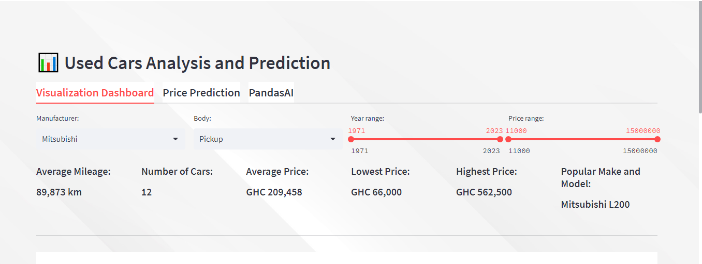

# Data Analyst/Data Scientist

#### Technical Skills: Python, SQL, PowerBI, Google Sheets & Excel, Streamlit

## Projects
### Used Car Analysis and Price Prediction (In Progress)
[Link](https://cars-analysis.streamlit.app/)

Data used is **scraped** from used car portals in Ghana, which is stored in **MongoDB Cloud**. The data is then explored and analyzed using Python in a Jupyter Notebook. A dashboard is built and deployed using **Streamlit**. The key objective here is double-sided. First, persons who are looking to purchase used cars have this platform to explore features of a used car and how it affects it price. Secondly, used car dealers can use this platform as a guide to inform pricing, etc.
Price prediction feature ongoing*

### HR Employee Data Analysis
[GitHub](https://github.com/GeekiAdubea/HR-Dashboard-MySQL-PowerBI)

This project highlights skills in SQL and PowerBI. Data used is a csv file which is cleaned and analyzed in MySQL. The results of the analysis is then exported to PowerBI to create a visualization dashboard.

## Work Experience
**Data Analytics Scientist @ Superfluid Labs (_May 2021 - Present_)**
- To track performance of agents, I worked with a product team to build a monitoring framework using Python and Google
Sheets. Performance of agents increased by 12%
- Built a customer segmentation model in Python to aid targeted customer marketing and support.
- Led an A/B testing project to research various contribution behaviours for a pensions company. This resulted in improved
processes to encourage contributions.
- Moderated a series of webinars on the benefits and applications of data analytics for business growth.

**Data Science Intern @ Maxim Nyansa IT Solutions (_January – June 2020_)**
- Collaborated with stakeholders to identify analytical requirements.
- Identified and tracked metrics to measure impact of a social intervention project using Google
Sheets.
- Created data visualisations, translating data sets into understandable visual representations.

